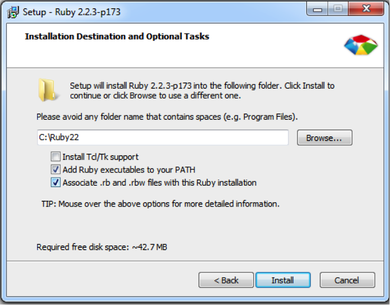
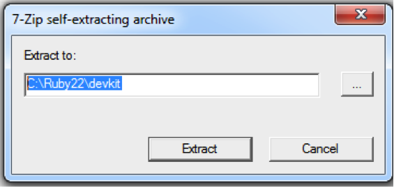
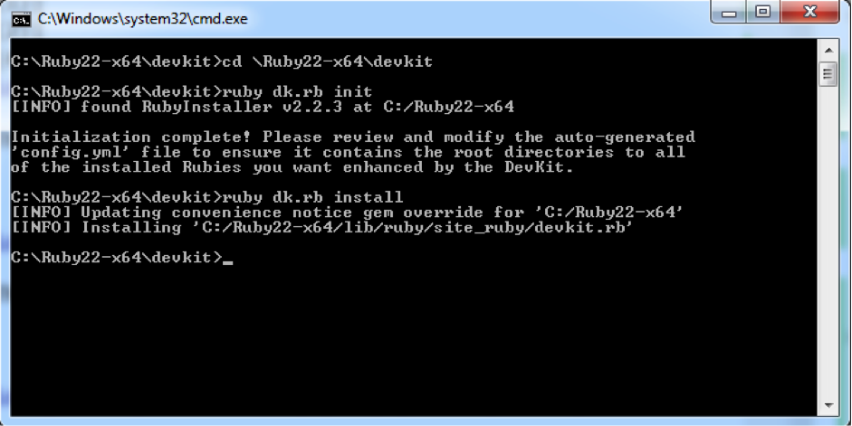

# Getting started on Windows
## Download the Windows installation files from dropbox
Go to the [ATDD dropbox folder](http://bit.ly/atdd-setup-zip) and click the `Download` button. You should have a `Setup.zip` file in your downloads folder. Unzip the `Setup.zip` file.

## Windows 32 Bit or 64 bit?
Determine whether your system is 32 bit or 64 bit (`Control Panel\System and Security\System` and look for System Type).
If you are running 32 bit then you should use the files under the `\Setup\x86` folder. If you are running 64 bit then you should use the files under the `\Setup\x64` folder.

## Install ruby
You will need a Ruby installed. The following ruby versions are supported:
  - 1.9.3
  - 2.0.0
  - 2.1.0
  - 2.2.0  
  - 2.2.1
  - 2.2.2
  - 2.2.3
  - 2.3.1

Other rubies (except 1.8.x and earlier) will likely work but have not been tested.

You can check if you have a ruby installed and its version by entering the following at a command prompt:

```
ruby -v
```
You should something like:

```
ruby 2.2.3p173 (2015-08-18 revision 51636) [i386-mingw32]
```

If your version matches one of the versions listed above then you are all set and you can jump to `Installing dependencies`.

If you don't have a supported Ruby installed, the following instructions will get you up and going with `Ruby 2.2.3`.

### Install Ruby
Run the downloaded `rubyinstaller-2.2.3.exe` file and accept the defaults until you see this screen and do the following:

 ]

*	Enter C:\Ruby22 as the installation folder
* Check ‘Add Ruby executables to your PATH’
* Check ‘Associate .rb and .rbw files with this Ruby installation’
* Click `Install`


You can now check your ruby version by entering the following at a command prompt:

```
ruby -v
```

You should something like:

```
ruby 2.2.3p173 (2015-08-18 revision 51636) [i386-mingw32]
```

See the [Ruby installation page](https://www.ruby-lang.org/en/documentation/installation/)
for additional installation instructions if this does not work for you.

## Install the DevKit
Run the `DevKit-mingw64-XX-4.7.2-20130224-1151-sfx.exe` file (where the `XX` is `32` if you are running 32 bit or `64` if you are running 64 bit. This file is simply a self-extracting archive. It is recommended to extract it in the same folder as Ruby was installed to i.e. `C:\Ruby22\devkit`:



In a command window, go to the folder where you installed the DevKit e.g. `C:\Ruby22\devkit` and enter the following commands at a command prompt:

```sh
ruby dk.rb init
ruby dk.rb install
```

The results should look something like:



## Copy ruby binaries
Copy all the files in the `setup\x86\bin` (32 bit) or `setup\x64\bin` (64 bit) folder to the `C:\Ruby22\bin` folder.

## Install dependencies
Run the following:
```
gem update --system
gem install --no-ri --no-rdoc rspec
gem install --no-ri --no-rdoc win32console
gem install --no-ri --no-rdoc watir-webdriver
gem install --no-ri --no-rdoc cucumber
gem install --no-ri --no-rdoc bundler
```

## Update gems
Open a command shell and `cd` to the `atdd_training\ruby` folder:
```sh
cd <local folder>\atdd_training\ruby
```

Update local gems using `bundler`:
```sh
bundle install
```

## Run the tests
Once you have successfully installed ruby and cucumber you are ready to [run the tests](./Running-tests.md).
